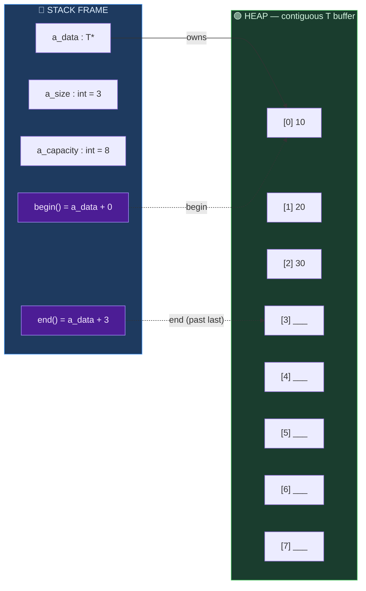
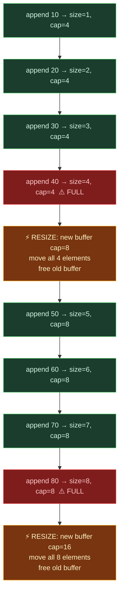
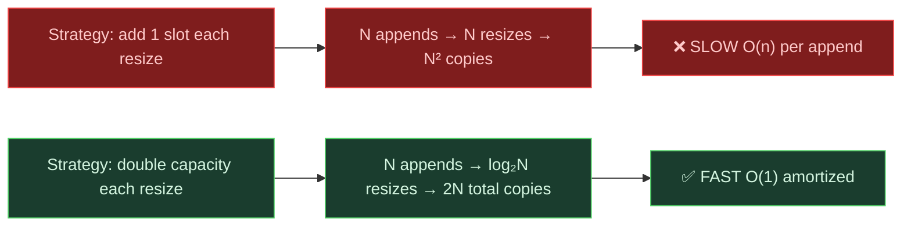

# Design Proposal: DynamicArray&lt;T&gt;

> **What is it?** A contiguous block of heap memory that automatically resizes itself when full, providing constant-time amortized O(1) appends and O(1) random access while hiding the complexities of raw memory management from the user.

---

## Section 1 — Public API

### State & Information

| Function | Signature | Description |
|---|---|---|
| `size` | `int size() const` | Returns how many items are currently alive in the array |
| `capacity` | `int capacity() const` | Returns how many total slots exist before a resize is needed |
| `isEmpty` | `bool isEmpty() const` | Returns `true` if the array holds zero elements |

### Reading Data

| Function | Signature | Description |
|---|---|---|
| `get` | `const T& get(int index) const` | Bounds-checked access — throws `std::out_of_range` if index is invalid |
| `operator[]` | `T& operator[](int index)` | Direct memory reference, no bounds check — maximum speed |

### Modifying the Array

| Function | Signature | Description |
|---|---|---|
| `append` | `void append(const T& value)` | Adds to the end; triggers a resize if `size == capacity` |
| `insert` | `void insert(int index, const T& value)` | Shifts elements right, places value at index |
| `remove` | `void remove(int index)` | Removes at index, shifts elements left to close gap |
| `popBack` | `void popBack()` | Removes the last element in O(1) — no shifting |
| `clear` | `void clear()` | Destroys all elements, resets size to 0 |

### Searching

| Function | Signature | Description |
|---|---|---|
| `contains` | `bool contains(const T& value) const` | Returns `true` if value exists anywhere in the array |
| `indexOf` | `int indexOf(const T& value) const` | Returns the first index where value is found, or `-1` |

### Iterators

| Function | Signature | Description |
|---|---|---|
| `begin` | `T* begin()` | Pointer to the first element |
| `end` | `T* end()` | Pointer one past the last element |

> **Why raw pointers as iterators?** Since DynamicArray stores elements in a contiguous buffer (`T* a_data`), a raw pointer already does everything a random-access iterator needs: `*ptr` dereferences, `++ptr` advances, `ptr != end` compares. Zero overhead, maximum speed, and automatically compatible with range-based `for` loops.

### Rule of Five

| Member | Purpose |
|---|---|
| `DynamicArray()` | Default constructor — initial capacity = 4 |
| `~DynamicArray()` | Destroys all elements, frees heap buffer |
| `DynamicArray(const DynamicArray&)` | Deep copy — allocates new buffer, copies all elements |
| `operator=(const DynamicArray&)` | Deep copy assignment |
| `DynamicArray(DynamicArray&&) noexcept` | Move constructor — steals the buffer pointer in O(1) |
| `operator=(DynamicArray&&) noexcept` | Move assignment — steals buffer, nulls out source |

**Range constructor (duck typing):**
```cpp
template <typename InputIt>
DynamicArray(InputIt first, InputIt last);  // build from any iterator range
```
This allows constructing a DynamicArray directly from a LinkedList's iterators (and vice versa) — compile-time duck typing.

---

## Section 2 — Memory Layout

### Stack vs. Heap Structure



- **Stack (blue):** `a_data`, `a_size`, and `a_capacity` are stack variables — cheap to create and destroy.
- **Heap (green):** The actual data buffer is one contiguous block on the heap.
- Slots `[a_size .. a_capacity − 1]` are allocated but uninitialised (shown as `___`).
- `begin()` returns `a_data + 0`; `end()` returns `a_data + a_size` (one past last valid element). This is how range-based `for` knows where to stop.

### Resize Trace



---

## Section 3 — Complexity Estimates

| Operation | Best | Average | Worst | Explanation |
|---|---|---|---|---|
| `append(value)` | O(1) | **O(1) amortized** | O(n) | *See amortized proof below* |
| `get(i)` / `operator[]` | O(1) | O(1) | O(1) | Pointer arithmetic: `a_data + i`. No traversal — CPU calculates address in one step |
| `insert(i, value)` | O(1) | O(n) | O(n) | Best: insert at end with space. Worst: insert at front — all n elements shift right |
| `remove(i)` | O(1) | O(n) | O(n) | Best: remove last element. Worst: remove first — all n−1 elements shift left |
| `popBack()` | O(1) | O(1) | O(1) | Decrements `a_size`, destroys last element — no shifting ever occurs |
| `clear()` | O(1) | O(1)–O(n) | O(n) | O(1) for primitive types (skip destructor loop). O(n) for complex types — must call `~T()` on each element |
| `contains()` / `indexOf()` | O(1) | O(n) | O(n) | Best: element at index 0. Worst: not found — full scan of n elements |
| Move constructor | O(1) | O(1) | O(1) | Steal 3 values (`a_data`, `a_size`, `a_capacity`). Zero heap work |
| Copy constructor | O(n) | O(n) | O(n) | Must allocate new buffer and copy every element |

### Amortized O(1) Proof for `append`

The **amortized cost** measures the *average cost per operation over a long sequence*, not the cost of a single worst-case call.

**Why O(1) amortized, even though a single resize is O(n)?**

Resizes happen at sizes 4, 8, 16, 32 … — only when the array is completely full. Between each pair of resizes, there are exactly as many cheap O(1) appends as the current capacity. The total copying work across all resizes from size 1 to N is:

```
1 + 2 + 4 + 8 + … + N/2 = N − 1   (geometric series)
```

So across N appends, the total work is N (the appends themselves) + N−1 (all copies from all resizes) ≈ 2N. Divided by N appends → **≈ 2 operations per append → O(1) amortized**.



---

## Section 4 — Design Decisions

| Decision | Our Choice | What We Rejected | Reason |
|---|---|---|---|
| **Initial capacity** | 4 | 1 (too many early resizes), 16 (wastes memory for small arrays) | Avoids the slowdown of immediate resizes while using near-zero space. 4 slots is effectively free. |
| **Resize factor** | × 2 (doubling) | × 1.5 (more resizes, more copies), +1 constant (O(n²) total copy cost) | Doubling gives log₂(N) total resizes → amortized O(1) append. This is exactly how `std::vector` works. |
| **Memory allocation** | `std::malloc` + placement new | `new T[capacity]` | `new T[]` immediately constructs N default objects — forces every type to be default-constructible, wastes CPU for unused slots. `malloc` gives raw bytes; we control when objects are built. |
| **Object destruction** | `if constexpr` + explicit `~T()` | Simple loop calling `~T()` | Calling `~T()` on a primitive like `int` is invalid syntax — compile error. `if constexpr` skips the loop for trivial types at compile time, maximising speed. |
| **Error handling** | `std::out_of_range` exception | Sentinel `-1` / silent no-op | A sentinel could be a valid stored value (e.g., an array of negative integers). An exception is explicit and immediately visible during testing. |
| **No shrinking** | Capacity only grows | Shrink when half-empty | Shrinking risks resize→shrink→resize cycles near the threshold. `std::vector` also never shrinks automatically. |

---

## Section 5 — C++ Tools Planned

| Tool | Header | Why We Need It |
|---|---|---|
| `std::malloc` / `std::free` | `<cstdlib>` | Request raw unformatted memory from the OS without constructing objects |
| Placement new | `<new>` | Construct objects inside already-allocated raw memory |
| `std::move` | `<utility>` | Transfer ownership of heavy objects without copying during resize |
| `if constexpr` + `std::is_trivially_destructible<T>` | `<type_traits>` | Skip destructor loop at compile time for primitive types — zero runtime overhead |
| `std::out_of_range` | `<stdexcept>` | Throw readable errors for out-of-bounds access |
