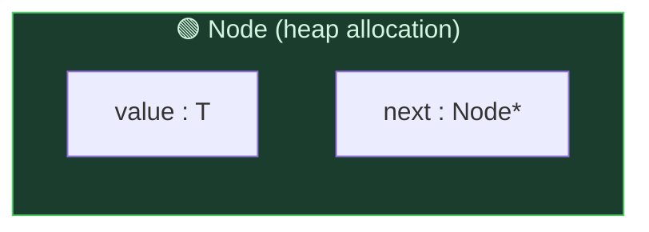
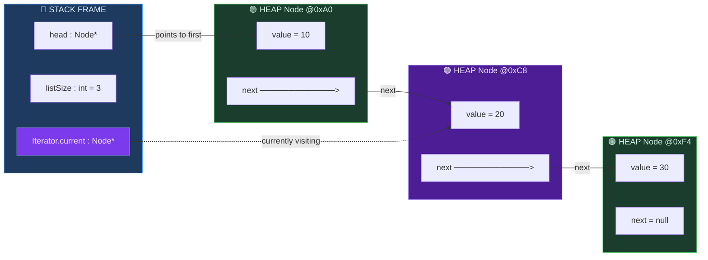
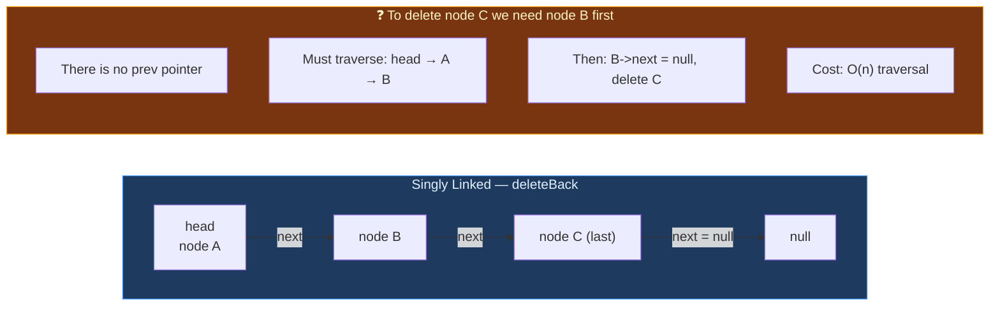
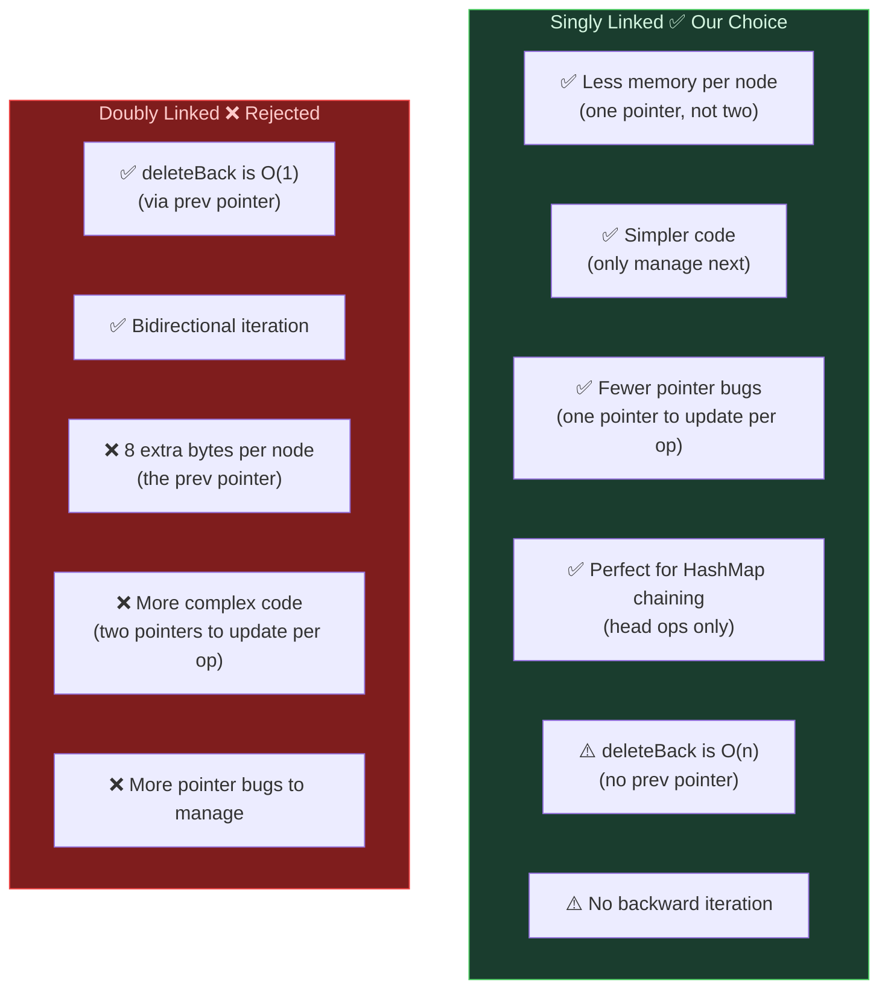
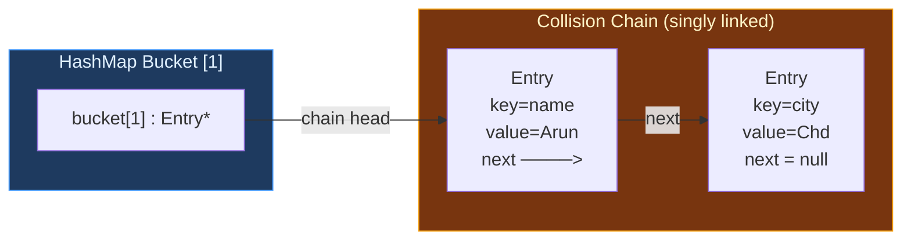

# Design Proposal: LinkedList&lt;T&gt;

> **What is it?** A collection of dynamically allocated, non-contiguous nodes where each node holds a value and a single pointer to the next node. Allows O(1) insertion and deletion at the front without shifting any memory — unlike a contiguous array.

---

## Section 1 — Public API

### Lifecycle Management (Rule of Five)

| Member | Purpose |
|---|---|
| `LinkedList()` | Default constructor — `head` = `nullptr`, `listSize` = 0 |
| `~LinkedList()` | Traverses from `head` and deletes every node, preventing memory leaks |
| `LinkedList(const LinkedList&)` | Deep copy — allocates new nodes with the same values in the same order |
| `operator=(const LinkedList&)` | Deep copy assignment |
| `LinkedList(LinkedList&&) noexcept` | Move constructor — steals the `head` pointer in O(1) |
| `operator=(LinkedList&&) noexcept` | Move assignment |

**Range constructor (duck typing):**
```cpp
template <typename InputIt>
LinkedList(InputIt first, InputIt last);  // build from any iterator range
```

### Modifiers — Adding Elements

| Function | Signature | Complexity | Description |
|---|---|---|---|
| `insertFront` | `void insertFront(T value)` | O(1) | New node becomes `head` — no traversal needed |
| `insertBack` | `void insertBack(T value)` | O(n) | Must walk from `head` to the last node to append |
| `insert` | `void insert(int index, T value)` | O(n) | Traverse to position `index`, rewire `next` pointers. Throws `std::out_of_range` if invalid |

### Modifiers — Removing Elements

| Function | Signature | Complexity | Description |
|---|---|---|---|
| `deleteFront` | `void deleteFront()` | O(1) | Save `head`, move `head` = `head->next`, delete saved node |
| `deleteBack` | `void deleteBack()` | O(n) | Must traverse to the second-to-last node — **no `prev` pointer exists** |
| `remove` | `void remove(int index)` | O(n) | Traverse to `index - 1`, rewire `next` to skip the target node, delete it |
| `clear` | `void clear()` | O(n) | Walk the list, delete every node, set `head` = `nullptr` |

### Element Access & Search

| Function | Signature | Complexity | Description |
|---|---|---|---|
| `get` | `T get(int index) const` | O(n) | Traverse `index` steps from `head` — no random access in linked list |
| `search` | `bool search(T value) const` | O(n) | Linear scan from `head`; returns `true` if found |

### Utility & Sizing

| Function | Signature | Complexity | Description |
|---|---|---|---|
| `size` | `int size() const` | O(1) | Returns stored `listSize` counter |
| `isEmpty` | `bool isEmpty() const` | O(1) | Returns `head == nullptr` |
| `print` | `void print() const` | O(n) | Prints `10 -> 20 -> 30 -> null` |

### Iterators

| Member | Type | Description |
|---|---|---|
| `Iterator` | Struct wrapping `Node*` | Forward-only — supports `++` but not `--` |
| `begin()` | `Iterator` | Points to `head` |
| `end()` | `Iterator` | Points to `nullptr` (sentinel past the last node) |

> **Why a custom Iterator struct instead of a raw pointer?** LinkedList nodes are *not* contiguous in memory — `node + 1` would point to random garbage. A raw pointer cannot navigate the list. The `Iterator` struct wraps a `Node*` and overloads `++` to follow the `next` pointer.

> **Why `forward_iterator_tag`?** We only have a `next` pointer — there is no way to go backward. `std::forward_iterator_tag` correctly communicates to the compiler and standard algorithms that this iterator is forward-only.

---

## Section 2 — Memory Layout

### Node Structure



Each node contains exactly two fields: the stored value and a pointer to the next node. There is no `prev` pointer — this is what makes it **singly** linked.

### Full List Layout (3 elements)



Key observations:
- **Stack (blue):** Only `head` and `listSize` live on the stack. There is no `tail` pointer.
- **Heap (green/purple):** Each `Node` is a *separate* heap allocation — they are NOT contiguous.
- Nodes are connected **one-way only** via `next`. You can only move forward through the list.
- Losing `head` = losing the entire list (memory leak). The destructor must follow `next` pointers to `delete` every node.
- **Iterator (purple):** A stack variable wrapping a `Node*`. `++it` follows `next`. When `current == nullptr`, the iterator equals `end()`.

### Why `deleteBack` is O(n) — No Backward Pointer



With a singly linked list, to delete the *last* node you must find the *second-to-last* node first — and the only way to get there is to walk from `head`. This is inherently O(n).

---

## Section 3 — Complexity Estimates

| Operation | Best | Average | Worst | Explanation |
|---|---|---|---|---|
| `insertFront(value)` | O(1) | O(1) | O(1) | Create one node, point it to old `head`, update `head`. No traversal at all |
| `insertBack(value)` | O(1)* | O(n) | O(n) | Must walk from `head` to the last node. (*O(1) only if list is empty.) No `tail` pointer is stored |
| `insert(index, value)` | O(1) | O(n) | O(n) | Best: index 0 → same as `insertFront`. Otherwise walk `index` steps from `head` |
| `deleteFront()` | O(1) | O(1) | O(1) | Save `head`, move `head = head->next`, delete saved node. Constant work |
| `deleteBack()` | O(n) | O(n) | O(n) | No `prev` pointer — must traverse to the second-to-last node, always O(n) |
| `remove(index)` | O(1) | O(n) | O(n) | Best: index 0 → same as `deleteFront`. Otherwise walk `index` steps |
| `search(value)` | O(1) | O(n) | O(n) | Best: value at `head`. Worst: not found — full scan of n nodes |
| `get(index)` | O(1) | O(n) | O(n) | Best: index 0 → return `head->value`. Otherwise walk `index` steps — no random access |
| `size()` / `isEmpty()` | O(1) | O(1) | O(1) | Returns stored `listSize` counter / evaluates `head == nullptr` |
| `clear()` | O(n) | O(n) | O(n) | Must delete every node |
| `print()` | O(n) | O(n) | O(n) | Must visit every node to print |
| Move constructor | O(1) | O(1) | O(1) | Steal `head` pointer and `listSize`. Zero node copying |
| Copy constructor | O(n) | O(n) | O(n) | Must allocate and copy every node |

> **There is no O(1) `get(index)`.** Unlike DynamicArray where `arr + index` is instant pointer arithmetic, a linked list has no base address — you must follow `next` pointers one by one from `head`. This is the fundamental tradeoff: linked lists gain O(1) front insertion/deletion but lose O(1) random access.

---

## Section 4 — Design Decisions

| Decision | Our Choice | What We Rejected | Reason |
|---|---|---|---|
| **Link type** | Singly linked (only `next`) | Doubly linked (`next` + `prev`) | Our LinkedList is primarily used for HashMap's separate chaining, where operations happen at the *head* of each chain. We don't need backward traversal or O(1) `deleteBack`. Singly linked uses less memory per node (one pointer instead of two) and has simpler code with fewer pointer bugs. |
| **Tail pointer** | Not stored (no `tail_`) | Stored `tail_` pointer | A stored `tail` would make `insertBack` O(1), but tracking it adds complexity — every `delete` and `insert` operation must correctly update it. Since our main use case is HashMap chaining (head operations only), the O(n) `insertBack` is an acceptable tradeoff. |
| **Size tracking** | Stored `listSize` counter | Recount on every `size()` call | Recounting traverses all n nodes every call — O(n). Storing `listSize` and incrementing/decrementing on add/remove keeps `size()` O(1). |
| **Error handling** | `std::out_of_range` for invalid indices | Return `nullptr` / silent no-op | Silent failure could corrupt the list state invisibly. An exception is immediately visible during testing. |
| **Iterator direction** | Forward-only (`std::forward_iterator_tag`) | Bidirectional | We only have `next` pointers — `--it` is physically impossible without `prev`. `forward_iterator_tag` correctly communicates this to the compiler. |

### Singly vs. Doubly Linked — The Tradeoff



**When doubly linked would be better:** If we needed O(1) tail deletion, reverse iteration, or bidirectional algorithms. Since our LinkedList is mainly a building block for HashMap chaining — where only `insertFront` and head-based lookups are needed — the added complexity of doubly linked is not justified.

---

## Section 5 — Bidirectional Conversion via Duck Typing

Both DynamicArray and LinkedList will expose iterators and range-based constructors. Even with a forward-only iterator, conversion works **both ways automatically**:

```cpp
// LinkedList → DynamicArray
LinkedList<int> list;
list.insertBack(10); list.insertBack(20); list.insertBack(30);
DynamicArray<int> arr(list.begin(), list.end());   // [10, 20, 30]

// DynamicArray → LinkedList
DynamicArray<int> nums;
nums.append(40); nums.append(50); nums.append(60);
LinkedList<int> list2(nums.begin(), nums.end());   // 40 -> 50 -> 60 -> null

// Range-based for works on both:
for (int val : list) { /* 10, 20, 30 */ }
for (int val : arr)  { /* 10, 20, 30 */ }
```

The compiler checks only that `*it`, `++it`, and `it != end` are valid. It doesn't care whether the iterator comes from an array or a linked list — this is **compile-time duck typing**.

---

## Section 6 — How LinkedList Powers HashMap

HashMap uses the LinkedList concept internally for its **separate chaining** collision strategy. Each bucket in the HashMap is effectively a mini singly linked list of `Entry` nodes:



All HashMap chain operations happen at the **head** of the chain:
- **Insert:** prepend new entry at head — O(1)
- **Lookup:** scan from head to find matching key — O(chain length)
- **Delete:** track `prev` during scan, unlink — O(chain length)

This is exactly why singly linked is the right choice: HashMap chaining only ever needs `insertFront` and forward traversal — the two things a singly linked list does cheaply.

---

## Section 7 — C++ Tools Planned

| Tool | Header | Why We Need It |
|---|---|---|
| `new` / `delete` | built-in | Allocate and free individual `Node` objects |
| `std::move` | `<utility>` | Move constructor — steal `head` pointer in O(1) |
| `std::out_of_range` | `<stdexcept>` | Throw readable errors for invalid indices or empty-list access |
| `std::ptrdiff_t` | `<cstddef>` | Required by iterator traits (`difference_type`) |
| `std::forward_iterator_tag` | `<iterator>` | Tells the compiler our Iterator is forward-only (matches singly linked structure) |
